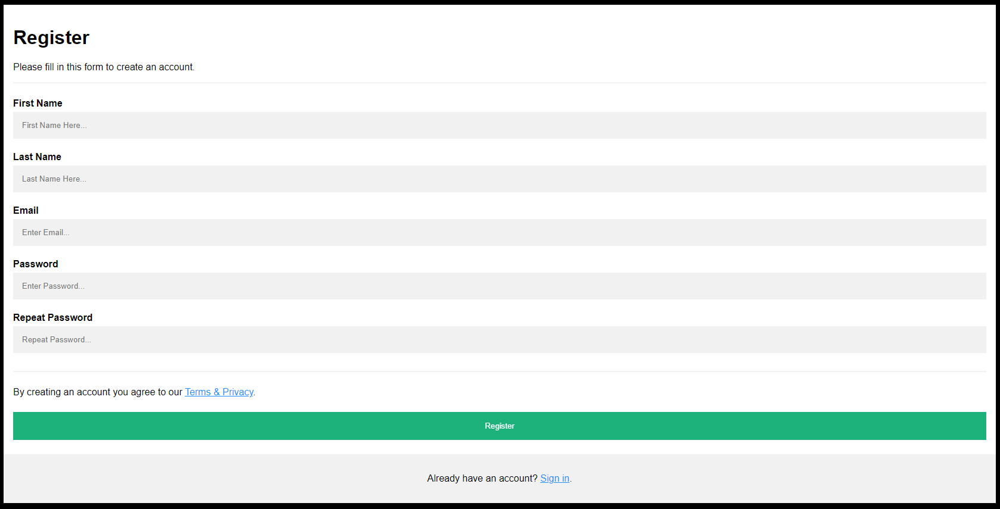

# Guide du Projet : Authentification Sécurisée

## TP du groupe composé de :
- **ADANHOUNDJI Eliel Fresnel M.**
- **AHOUANGASSI Elie**
- **LOPO Paula**

---

## 🚀 Prérequis

### Pour Windows :
1. **Installez XAMPP (inclut PHP, SQLite et Apache)**
    - Téléchargez XAMPP depuis le [site officiel](https://www.apachefriends.org/index.html)
    - Choisissez la version avec PHP 8.1 ou supérieur
    - Pendant l'installation, sélectionnez au minimum **Apache**, **PHP**, et **SQLite**.
    - Les systèmes Linux viennent généralement avec un serveur web préinstallé.

2. **Installez Composer**
    - Téléchargez l'installateur Windows sur [getcomposer.org](https://getcomposer.org/download/)
    - Exécutez l'installateur Composer-Setup.exe
    - Assurez-vous de sélectionner votre PHP lors de l'installation (généralement dans C:\xampp\php\php.exe)

3. **Vérifiez vos installations dans le terminal (CMD ou PowerShell) :**
    

bash
    php -v
    composer -v


### Pour Linux/MacOS :
- **PHP 8.2 ou supérieur :**  
    

bash
    php -v


- **Composer :**
    

bash
    composer -v


- **SQL ou phpMyAdmin** : Assurez-vous que vous avez accès à une base de données MySQL ou SQLite.

---

## 📥 Installation

### Windows :
1. Clonez ou téléchargez le projet
    - **Option 1 :** Téléchargez le ZIP et extrayez-le dans C:\xampp\htdocs\tdd-php
    - **Option 2 :** Utilisez Git Bash :  
    

bash
    cd C:\xampp\htdocs
    git clone https://github.com/elielfresnel/TDD-EXAM.git


2. Ouvrez le terminal (CMD) en tant qu'administrateur :
    

bash
    cd C:\xampp\htdocs\tdd-php
    composer install
    composer dump-autoload -o


3. Modifiez le fichier config.php qui se trouve dans le répertoire src du projet.
4. Créez une base de données register et importez la table register.sql.
5. Importez la base de données database.SQL.

### Linux/MacOS :

bash
git clone https://github.com/elielfresnel/TDD-EXAM.git
cd TDD-EXAM

## 🚦 Lancer les tests

### Windows :
1. Dans le terminal, exécutez :
    ```bash
    cd C:\xampp\htdocs\tdd-php
    .\vendor\bin\phpunit
    ```
2. Pour un test spécifique :
    ```bash
    .\vendor\bin\phpunit Tests\AllTest.php
    .\vendor\bin\phpunit Tests\SecurityTests.php
    ```

### Linux/MacOS :
```bash
./vendor/bin/phpunit Tests/SecurityTests.php
./vendor/bin/phpunit Tests/AllTest.php
```

---

## 📝 Structure du Projet

```
TDD-PHP/
├── composer.json
├── composer.lock  
├── database.SQL  # Base de données           
├── README.md 
├── register.sql  # Table de base de données
├── register.txt  
└── Tests/
    ├── SecurityTests.php
    └── AllTests.php
└── src/
    ├── action.php
    ├── home.php
    ├── index.php
    ├── config.php
    ├── logout.php
    ├── profile-card.css
    ├── signin_action.php
    ├── signin.php
    └── style.css
```

---

## 🌐 Lancement du Projet

### Avec XAMPP (Windows) :
1. Démarrez **XAMPP Control Panel**.
2. Activez **Apache**.
3. Ouvrez votre navigateur et accédez à :  
    [http://localhost/TDD-EXAM](http://localhost/TDD-EXAM)

### Avec le serveur PHP intégré :
#### Windows (CMD) :
```bash
cd C:\xampp\htdocs\tdd-php
php -S localhost:8000
```

#### Linux/MacOS :
```bash
php -S localhost:8000
```



---

## 📚 Documentation Utile
- [XAMPP Documentation](https://www.apachefriends.org/docs/)
- [PHPUnit Documentation](https://phpunit.de/)
- [Composer Windows Documentation](https://getcomposer.org/doc/00-intro.md)

---

## 📫 Support

En cas de problème :
1. **Écrivez à Eliel Fresnel** au +229 90330808
2. **Créez une issue sur GitHub** avec une capture d'écran des erreurs, s'il vous plaît.

---

### Projet réalisé dans le cadre d'un contrôle terminal en groupes de 3 pour le cours de **TDD (Test Driven Development)**.
